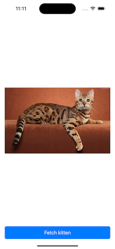

# KittenDemo

KittenDemo is a simple iOS demo project written in Objective-C, designed to illustrate how to make network calls to a REST server using the `NSURLSession` with the delegate pattern. This project showcases an "old-school" OOP method of performing network operations, following a variant of the MVC pattern: MVC-Store. The project aims for loose coupling among objects. Any over-engineering is meant as a guide to implementing more complicated applications.

## Features

- **Network Requests using Delegate Pattern**: The project demonstrates how to use `NSURLSession` with the delegate pattern instead of blocks, which is a more classic OOP approach.
- **MVC-Store Pattern**: The data fetching logic is encapsulated in a "Store" class (`KittenHTTPStore`), adhering to a variant of the traditional MVC pattern.
- **UIKit and Storyboard UI**: The UI is built using UIKit and Storyboards, providing a clean and simple interface to fetch and display cat images from a third-party API.

## Screenshots



## Source Code Highlights

- **ViewController.h/m**: The main view controller that handles user interactions and updates the UI based on the data fetched from the `KittenHTTPStore`.
- **KittenHTTPStore.h/m**: The "Store" class responsible for making network requests to the third-party cat API and returning the results via a delegate.
- **Main.storyboard**: Contains the UI layout for the app, including a UIImageView to display the fetched cat image and a UIButton to trigger the fetch.

## API Key

The project requires an API key to access the third-party service that provides cat images. The API key must be placed in a file named `api.key` in the root directory of the project. The key will be read at runtime and used to authenticate requests to the API.

```
KittenDemo/
├── KittenDemo/
├── KittenDemo.xcodeproj
├── Main-UI-screenshot.png
├── README.md
├── LICENSE.md
├── api.key
```

For information on obtaining an API key, see: [The Cat API: Cats as a service.](https://thecatapi.com)

## How It Works

1. **Fetching the Kitten Image**: When the user taps the "Fetch kitten" button, the `ViewController` triggers a network request via the `KittenHTTPStore`.
2. **Network Call with Delegate Pattern**: The `KittenHTTPStore` uses the `NSURLSession` with a delegate to make the network request. The delegate methods handle the response and error cases.
3. **Updating the UI**: The fetched image is sent via a message to an object conforming to the `KittenUpdating` protocol. The UI is then updated on the main thread with the new kitten image.

## Getting Started

### Prerequisites

- Xcode (latest version)
- An API key for the third-party cat image service.

### Setup

1. Clone the repository:
   ```bash
   git clone https://github.com/yourusername/KittenDemo.git
   cd KittenDemo
   ```

2. Create a file named `api.key` in the root directory of the project and paste your API key into this file.

3. Open the project in Xcode.

4. Build and run the project on your iOS simulator or device.

## License

This project is licensed under the BSD-3-Clause - see the [LICENSE.md](LICENSE.md) file for details.

## Authors

* **[Mario Diana](https://github.com/software-mariodiana)** - *Initial work*
